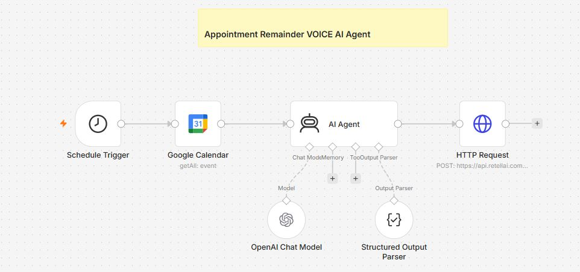

# 📞 AI Appointment Reminder Voice Agent using n8n, Google Calendar, Retell AI & OpenAI


---

# 📖 Overview

This n8n workflow automatically reminds customers about their upcoming appointments using an AI-powered voice agent.

The workflow periodically checks Google Calendar for scheduled events, extracts appointment details, uses OpenAI to structure the information into a standardized JSON format, and initiates an outbound AI phone call using Retell AI.

The AI voice agent delivers personalized appointment reminders including the customer's name, appointment reason, and scheduled time, reducing missed appointments and improving customer engagement. The workflow uses a Schedule Trigger, Google Calendar integration, OpenAI GPT-4.1, Structured Output Parser, and the Retell AI API. 

-----
# 🖼️ Workflow Layout



---

# ✨ Features

* ⏰ Automatic scheduled execution
* 📅 Retrieve upcoming Google Calendar events
* 🤖 AI-powered appointment information extraction
* 📋 Structured JSON response generation
* ☎️ Automatic AI voice call initiation
* 👤 Personalized reminder messages
* 📞 Retell AI Voice Agent integration
* 🧠 GPT-4.1 powered appointment parsing
* 🚀 Fully automated appointment reminder workflow

---

# 💼 Use Cases

### 🏥 Healthcare Clinics

Automatically remind patients about upcoming appointments.

---

### 🦷 Dental Clinics

Reduce missed appointments through automated voice reminders.

---

### 🏢 Corporate Meetings

Notify employees and clients before scheduled meetings.

---

### 💼 Consulting Services

Send appointment reminders without manual phone calls.

---

### 🎓 Educational Institutions

Notify students about counseling sessions and appointments.

---

### 🏦 Financial Services

Remind customers about consultation meetings.

---

### 🚗 Service Centers

Call customers before scheduled vehicle servicing appointments.

---

# ⚙️ Workflow Nodes

## ⏰ 1. Schedule Trigger

**Node Type**

Schedule Trigger

### Purpose

Starts the workflow automatically based on a configured schedule.

### Configuration

* Runs daily
* Trigger Time: **9:00 AM**

### Output

Initiates the workflow execution automatically. 

---

## 📅 2. Google Calendar

**Node Type**

Google Calendar

### Purpose

Fetches appointment events from Google Calendar.

### Operation

Get All Events

### Configuration

Calendar:

```
abcxyz09@gmail.com
```

### Retrieves

* Event Description
* Start Time
* End Time
* Appointment Details

### Output Example

```json
{
  "description": "John Carter | +15551234567 | AI Consultation",
  "start": {
    "dateTime": "2026-07-22T10:00:00Z"
  },
  "end": {
    "dateTime": "2026-07-22T10:30:00Z"
  }
}
```


---

## 🤖 3. AI Agent

**Node Type**

AI Agent

### Purpose

Extracts structured appointment information using OpenAI.

### Model

GPT-4.1

### Input

* Appointment Description
* Start Time
* End Time

### AI Responsibilities

* Extract customer's name
* Extract phone number
* Extract appointment reason
* Extract email
* Convert dates into ISO format
* Return valid JSON only

### Output Example

```json
{
  "output": {
    "name": "John Carter",
    "phone_number": "+15551234567",
    "reason": "AI Consultation",
    "email": "john@example.com",
    "start_time": "2026-07-22T10:00:00Z",
    "end_time": "2026-07-22T10:30:00Z"
  }
}
```


---

## 🧩 4. Structured Output Parser

**Node Type**

Structured Output Parser

### Purpose

Validates AI responses using a predefined JSON schema.

### Required Fields

* Name
* Email
* Phone Number
* Appointment Reason
* Start Time
* End Time

### Benefits

* Ensures consistent AI responses
* Prevents malformed JSON
* Simplifies API integration


---

## 📞 5. HTTP Request (Retell AI)

**Node Type**

HTTP Request

### Purpose

Creates an outbound AI phone call using Retell AI.

### Method

POST

### Endpoint

```
https://api.retellai.com/v2/create-phone-call
```

### Dynamic Variables Sent

* Customer Name
* Phone Number
* Appointment Reason
* Start Time
* End Time

### Output

```json
{
  "call_id": "call_xxxxxxxxx",
  "status": "queued"
}
```

The AI Voice Agent automatically calls the customer with a personalized reminder. 

# Part 2 — Appointment Reminder Voice AI Agent

---

# ⚙️ Installation

### Step 1

Import `workflow.json` into n8n.

---

### Step 2

Create an **OpenAI Credential**.

Add your OpenAI API Key.

---

### Step 3

Connect your **Google Calendar Account**.

Grant permissions to read calendar events.

---

### Step 4

Configure the **Schedule Trigger**.

Example:

* Every Day
* Every Hour
* Every 30 Minutes

---

### Step 5

Configure the **AI Agent Prompt**.

Example:

* Create friendly reminder
* Mention appointment time
* Mention meeting location
* Ask for confirmation
* Keep message under 60 seconds

---

### Step 6

Configure Structured Output Parser.

Expected Output

```json
{
  "name":"John",
  "phone":"+15551234567",
  "appointment":"Dental Checkup",
  "date":"2026-08-10",
  "time":"10:30 AM",
  "message":"Hello John..."
}
```

---

### Step 7

Configure ReTell API.

Required Headers

```
Authorization:
Bearer YOUR_RETELL_API_KEY

Content-Type:
application/json
```

---

### Step 8

Update Phone Number Mapping.

Example

```
{{$json.phone}}
```

---

### Step 9

Run the workflow.

---

### Step 10

Activate Workflow.

---

# 🎨 Customization

## 📅 Reminder Timing

Examples

* 24 Hours Before
* 12 Hours Before
* 2 Hours Before
* 30 Minutes Before

---

## 🗣️ Voice Selection

Supported Voices

* Female Professional
* Male Professional
* Friendly Assistant
* Healthcare Voice

---

## 🌍 Multi-language Calls

Generate reminders in

* English
* Hindi
* Marathi
* Spanish
* French

---

## 🤖 AI Prompt

Customize reminder style.

Examples

* Formal
* Friendly
* Hospital
* Clinic
* Corporate
* Sales Meeting

---

## 📞 Follow-up Calls

Automatically create another reminder if patient doesn't answer.

---

## 📅 Calendar Filters

Only remind events having

```
Confirmed
```

Skip cancelled appointments.

---

# 🐞 Troubleshooting

## ❌ Google Calendar Error

Cause

Calendar credentials expired.

Solution

Reconnect Google Calendar Credential.

---

## ❌ OpenAI Error

Cause

API key invalid.

Solution

Verify OpenAI Credential.

---

## ❌ Voice Call Failed

Cause

Invalid phone number.

Solution

Validate phone number format.

---

## ❌ Retell API Error

Cause

API quota exceeded.

Solution

Upgrade API plan.

---

## ❌ AI Output Parsing Error

Cause

Invalid JSON response.

Solution

Enable Structured Output Parser.

---

## 💻 Technologies Used

* n8n
* OpenAI GPT-4o
* Google Calendar API
* Retell AI API
* Structured Output Parser
* JSON
* REST API
* AI Agents

---

# 🚀 Future Improvements

* SMS Reminder Integration
* WhatsApp Reminder
* Email Reminder Support
* Appointment Rescheduling
* Voice Confirmation Detection
* Google Sheets Logging
* CRM Integration
* Twilio Calling Support
* ElevenLabs Voice Support
* Patient Follow-up Automation

---

# 🤝 Contribution

Contributions are welcome!

You can help improve this workflow by:

* Adding support for additional calendar providers
* Improving AI reminder prompts
* Supporting multilingual voice agents
* Enhancing appointment confirmation workflows
* Integrating more voice calling providers
* Optimizing workflow performance

Please fork the repository, create a feature branch, and submit a pull request with your improvements.

---

# ⭐ Support

If you found this project useful:

* ⭐ Star the repository
* 🍴 Fork the project
* 🐛 Report issues
* 💡 Suggest new features
* 🤝 Contribute improvements

Your support helps improve AI automation workflows for the community.

